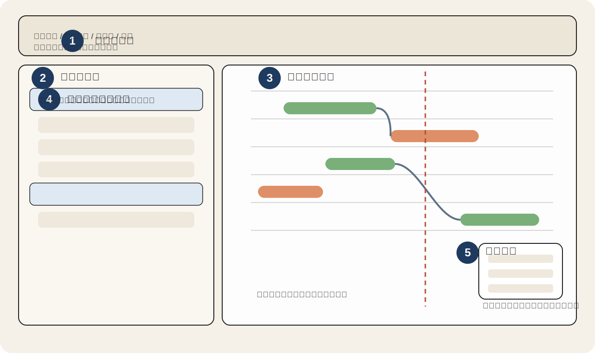
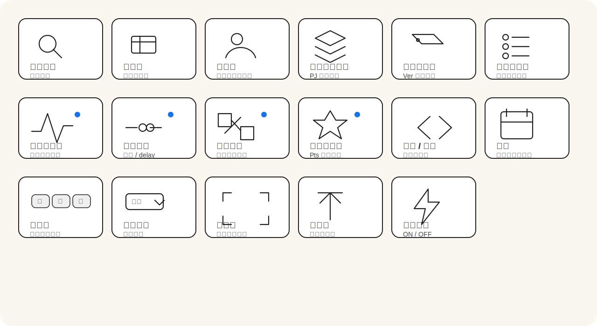
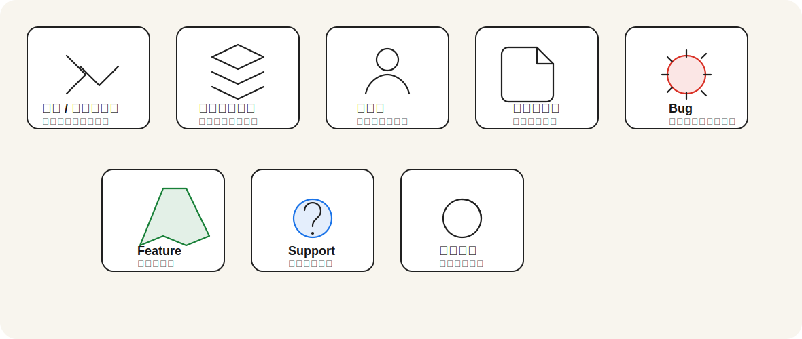
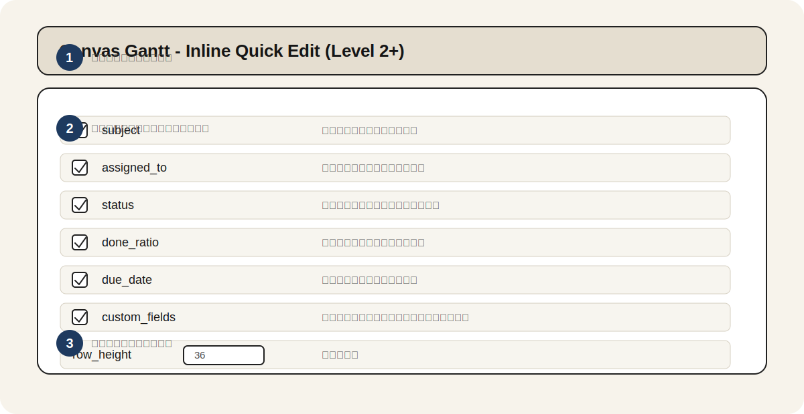

# Redmine Canvas Gantt 操作マニュアル

## 1. 概要

Redmine Canvas Gantt は、Redmine 上のチケットを Canvas ベースのタイムラインで高速に表示し、一覧編集やドラッグ操作でスケジュール調整できるプラグインです。標準のガントチャートよりも、表示量が多い案件や日程調整が多い案件に向いています。

このマニュアルでは、管理者の初期設定から、日常的な操作、画面に表示されるアイコンの意味までをまとめています。

## 2. 利用前の準備

### 2.1 管理者が最初に確認すること

1. Redmine の REST API を有効にします。
   `管理` -> `設定` -> `API` -> `REST による Web サービスを有効にする`
2. 対象プロジェクトで `Canvas Gantt` モジュールを有効にします。
   `プロジェクト` -> `設定` -> `モジュール`
3. 利用ロールに権限を付与します。
   `管理` -> `ロールと権限`
4. 必要に応じてプラグイン設定を調整します。
   `管理` -> `プラグイン` -> `Canvas Gantt` -> `設定`

### 2.2 必要な権限

| 権限 | 用途 |
| --- | --- |
| `view_canvas_gantt` | Canvas Gantt 画面を表示する |
| `edit_canvas_gantt` | タスク移動、期間変更、依存関係操作、インライン編集などを行う |

### 2.3 画面を開く

1. 対象プロジェクトを開きます。
2. プロジェクトメニューの `Canvas Gantt` をクリックします。

## 3. 画面の見方

### 3.1 画面全体

図の見方:

1. ツールバー: フィルタ、表示切替、ズーム、全画面表示などを操作します。
2. サイドバー: チケット一覧を表示します。列の表示切替やインライン編集に使います。
3. タイムライン: タスクバー、依存関係線、今日線を表示します。
4. グループヘッダー: プロジェクト単位または担当者単位のまとまりを表示します。
5. 詳細操作: 右クリックメニューや依存関係編集など、選択中タスクに対する操作を行います。

### 3.2 操作イメージ

ドラッグ操作の雰囲気は既存デモでも確認できます。

## 4. 基本操作

### 4.1 タスクを選択する

1. サイドバーの行、またはタイムライン上のタスクバーをクリックします。
2. 選択したタスクの行とバーが強調表示されます。

### 4.2 横スクロール / 縦スクロール

1. タイムラインをホイール操作すると縦方向に移動します。
2. 下部のスクロールバーやトラックパッド操作で横方向に移動します。
3. `トップ` ボタンを押すと、一覧の先頭行へ戻ります。

### 4.3 ズームを切り替える

1. ツールバーの `月` `週` `日` をクリックします。
2. 粗い俯瞰表示から、細かい日単位表示まで切り替わります。
3. `今日` ボタンを押すと、現在日付付近が中央に来ます。

### 4.4 前月 / 次月へ移動する

1. 左矢印ボタンで前月へ移動します。
2. 右矢印ボタンで次月へ移動します。

### 4.5 行の高さを変更する

1. ツールバーの行高メニューを開きます。
2. `極小` `小` `標準` `中` `大` から選びます。
3. 表示密度を優先する場合は `極小`、編集しやすさを優先する場合は `中` 以上が向いています。

## 5. 応用操作

### 5.1 タスクバーを移動する

1. タイムライン上のタスクバー本体をドラッグします。
2. 開始日と終了日がまとめて移動します。
3. 自動保存が有効なら即時保存されます。無効なら `保存` ボタンで確定します。

### 5.2 期間を変更する

1. タスクバーの左端または右端をドラッグします。
2. 片側だけの期間を調整できます。

### 5.3 依存関係を作成する

1. タスクバー端の依存ハンドルから別タスクへドラッグします。
2. 依存関係が線で描画されます。
3. 依存設定でデフォルト種別や delay 自動計算を有効にしている場合、その設定が適用されます。

### 5.4 依存関係を更新・解除する

1. 関連タスクを選択して、依存関係編集 UI を開きます。
2. 種別や delay を変更します。
3. 不要な場合は `依存関係を解除` を実行します。

### 5.5 サイドバーでインライン編集する

編集対象のセルをクリックまたは編集操作すると、チケット画面へ遷移せずに値を変更できます。

主な対象:

- 件名
- 担当者
- ステータス
- 進捗率
- 期日
- カスタムフィールド

### 5.6 カラム表示を切り替える

1. ツールバーの `カラム` メニューを開きます。
2. 表示したい列をチェックします。
3. サイドバーの列ヘッダー境界をドラッグすると横幅も変更できます。

### 5.7 フィルタを使う

1. `フィルタ` で題名文字列を入力します。
2. 担当者、プロジェクト、バージョン、ステータスは各フィルタボタンから絞り込みます。
3. `Clear` で個別フィルタを解除できます。

### 5.8 グループ化する

1. プロジェクトフィルタ内の `プロジェクトでグループ化` を有効にすると、プロジェクト単位でまとまります。
2. 担当者フィルタ内の `担当者でグループ化` を有効にすると、担当者単位でまとまります。
3. ヘッダー左の矢印で展開 / 折りたたみできます。

### 5.9 親子関係を変更する

1. サイドバーの行を別タスクへドラッグします。
2. ドロップ先タスクの子チケットとして移動します。
3. 右クリックメニューの `子チケット解除` を使うと親子関係を外せます。

### 5.10 子チケットを一括登録する

1. 対象タスクを選択します。
2. `チケット一括登録` を開きます。
3. 1 行に 1 件ずつ題名を入力して保存します。

## 6. アイコン早見表

### 6.1 ツールバーアイコン

| 見た目 | 用途 |
| --- | --- |
| 虫眼鏡 / 検索欄 | 題名文字列でタスクを絞り込みます |
| 列アイコン | サイドバーに表示する列を切り替えます |
| 人アイコン | 担当者で絞り込みます |
| レイヤー風アイコン | プロジェクトで絞り込みます |
| タグ風アイコン | バージョンで絞り込みます |
| 丸付き一覧アイコン | ステータスで絞り込みます |
| 波線アイコン | `進捗ライン` の表示 / 非表示を切り替えます |
| 2 点連結アイコン | 依存関係のデフォルト設定を開きます |
| ボックス連結アイコン | `依存関係に基づいて整理` を切り替えます |
| 星アイコン | 開始日のみ / 期日のみタスクの点表示を切り替えます |
| 左右矢印 | 前月 / 次月へ移動します |
| カレンダー | `今日` へ移動します |
| `月 / 週 / 日` | 表示粒度を切り替えます |
| 行高メニュー | 行の高さを変更します |
| 四隅アイコン | 全画面表示を切り替えます |
| 上向き矢印 | 一覧の先頭へ戻ります |
| 稲妻アイコン | 自動保存の ON / OFF を切り替えます |

### 6.2 サイドバーとグループヘッダーのアイコン

| 見た目 | 用途 |
| --- | --- |
| 右向き / 下向き矢印 | 親タスクやグループを展開 / 折りたたみます |
| 三層のレイヤー | プロジェクトグループヘッダーです |
| 人型 | 担当者グループヘッダーです |
| 書類 | 通常タスクを表します |
| 虫 | Bug 系トラッカーを表します |
| 星形 / ロケット風 | Feature 系トラッカーを表します |
| ヘルプ風マーク | Support 系トラッカーを表します |
| 円グラフ | 進捗率の視覚表示です |

### 6.3 右クリックメニューのアイコン

| 見た目 | 用途 |
| --- | --- |
| 鉛筆 | チケット編集画面を開きます |
| プラス | 子チケットを追加します |
| プラス | 新規チケットを追加します |
| 左向き矢印 | 親子関係を解除します |
| ゴミ箱 | チケットを削除します |
| 斜線付き丸 | 依存関係を解除します |

## 7. 画面の見どころ

### 7.1 タイムライン

- タスクバーの位置は開始日と終了日を表します
- 今日線を有効にすると、現在日付の位置が一目でわかります
- 依存関係はタスク間の線で表示されます

### 7.2 サイドバー

- `ID`、件名、担当者、ステータス、進捗、バージョンなどを一覧表示します
- 列幅はドラッグで変更できます
- 表示列はカラムメニューから切り替えます

## 8. 管理者設定

### 8.1 設定画面で調整できる項目

`管理` -> `プラグイン` -> `Canvas Gantt` -> `設定` では、次の項目を変更できます。

| 項目 | 用途 |
| --- | --- |
| `subject` | 件名のインライン編集を許可します |
| `assigned_to` | 担当者のインライン編集を許可します |
| `status` | ステータスのインライン編集を許可します |
| `done_ratio` | 進捗率のインライン編集を許可します |
| `due_date` | 期日のインライン編集を許可します |
| `custom_fields` | カスタムフィールドのインライン編集を許可します |
| `row_height` | 既定の行高を指定します |
| `use_vite_dev_server` | 開発時に `http://localhost:5173` のフロントエンド資産を使います |

### 8.2 設定の考え方

- 現場利用では `subject` `assigned_to` `status` `done_ratio` `due_date` を有効にすると操作効率が上がります
- 誤操作を避けたい場合は、編集項目を絞って運用します
- 表示密度を重視する場合は `row_height` を低めにします

## 9. 制約・注意点

- 依存関係の表示と編集は、ズームや表示範囲によって見え方が変わります
- 自動保存を無効にしている場合、変更は `保存` を押すまで確定しません
- 権限不足の利用者には編集操作が反映されません
- `redmica_ui_extension` など別プラグインの Select2 系 UI が干渉する場合があります
- 実際の表示項目や編集可否は、Redmine のロール、トラッカー設定、プラグイン設定に依存します

## 10. よくあるつまずき

### 10.1 `Canvas Gantt` メニューが表示されない

- プロジェクトで `Canvas Gantt` モジュールが有効か確認します
- 利用ロールに `view_canvas_gantt` 権限があるか確認します

### 10.2 編集できない

- `edit_canvas_gantt` 権限があるか確認します
- プラグイン設定で該当項目のインライン編集が有効か確認します
- 自動保存が OFF の場合は `保存` を押します

### 10.3 画面が空に見える

- プロジェクトに開始日 / 期日付きチケットが存在するか確認します
- フィルタ条件が厳しすぎないか確認します
- `今日` やズーム切替で表示位置を戻します

### 10.4 依存関係が作れない

- 編集権限があるか確認します
- 循環依存になる組み合わせでは作成できません
- 日付整合性の都合で delay が必要になる場合があります

### 10.5 見た目が崩れる

- プラグイン設定で `use_vite_dev_server` が不用意に有効になっていないか確認します
- 競合プラグインの UI 拡張がある場合は、検索可能セレクトボックスなどを無効にして確認します

## 11. 補足

- 本マニュアルの図版は、現在の UI 実装とローカル検証環境をもとに整理しています
- 画面内ラベルは Redmine の言語設定や導入済みプラグインにより一部異なる場合があります
